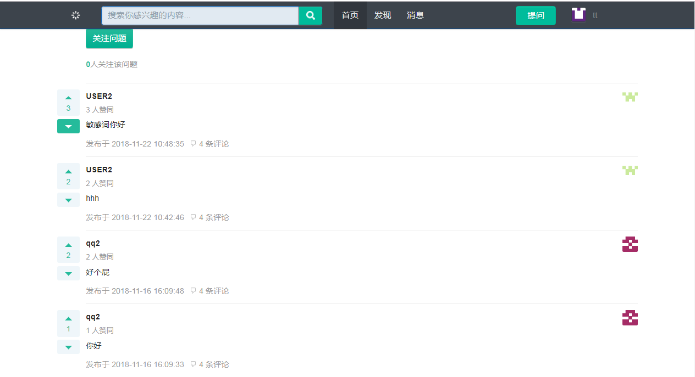

一个类似于贴吧、知乎等SNS网站。

基本功能来源于牛客网高级项目课。

## 开发工具 ##
主要是用SpringBoot+MyBatis+velocity开发，SpringBoot是包含Spring和SpringMVC的轻量级Web框架，为简化Spring的配置文件而产生，页面渲染采用velocity模板来进行设计，简化前端开发工作量，使用MyBatis与MySQL数据库进行交互。

## 基本功能： ##

用户管理模块

资讯发布模块

图片上传管理

评论中心管理

站内信模块

赞和踩的功能模块

邮件通知系统

资讯的排序功能

好友关注功能。

## 页面展示 ##

  
 