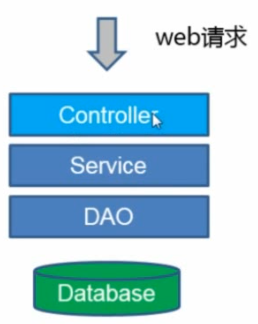

# 牛客网高级项目笔记 #

1.springboot

spring的核心：Beans、Core、Context、SeEL。

2.最简单WEB项目架构

  
 

3.项目目录构建：controller包、service包、model包、dao。

@**RequestMapping注解**

一般网页是通过一个url来进行访问，而url的访问方式一般是在Controller层中通过@RequestMapping直接来进行设置。例如：

    @RequestMapping(path = {"/", "/index"}, method = {RequestMethod.GET})//设置访问url访问方式，网页入口设置

当url中需要增加id属性进行访问时，可以通过@PathVariable注解进行解析，也可以通过@RequestParam设置请求参数例如：

     public String profile(@PathVariable("userId") int userId,
                           @PathVariable("groupId") String  
                           @RequestParam(value = "type", defaultValue = "1") int type,
                           @RequestParam(value = "key", required = false) String key) {
        return String.format("Profile Page of %s / %d, t:%d k: %s", groupId, userId, type, key);

@ResponseBody

一般在处理函数上加@Response注解，用以返回相应信息。

4.Http方法

GET:获取网页信息。
POST：提交数据，写入信息。例如发帖。
PUT：支持幂等性的POST，幂等性：相同请求无论执行多少次，都只执行一次。例如已经付款则不能进行第二次付款。

html的form只支持GET/POST。

5.模板

一般网页并不是简单的字符串，可以通过模板进行页面渲染。我们采用velocity模板。
通过配置下面语句可以将.vm文件转化为.html。

    spring.velocity.suffix=.html

Parse和Include。

6.request/response

7.重定向

301：永久转移，302：临时转移。

8.IOC：所有对象都通过依赖注入进行注入。

在用的地方进行注入，无序关注初始化 @Autowired。

9.AOP：

数据库设计

分实体得到表。

4个表：用户(User)、站内信(Message)、资讯(news)、评论(Comment)。

分内容得到属性。

**敏感词过滤**

前缀树。

**多线程**

ThreadLocal:线程局部变量。即使是一个static成员，每个线程访问的变量是不同的。常见于web中存储当前用户到静态工具类中，在线程的任何地方都可以访问到当前线程用户。

Executor:提供一个运行任务的框架，将任务和如何运行任务解耦。常用于提供线程池和定时任务服务。

## 评论中心 ##

通用新模板的开发流程：

- Database Column
- Model:模型定义，和数据库相匹配
- DAO：数据读取
- Service：服务包装
- Controller：业务入口
- Test

## 站内信 ##

## Redis ##
List：双向列表，适用于最新列表，关注列表lpush,lpop,blpop,lindex,lrange,lrem,linsert,lset,rpush.

Set:适用于无顺序集合，点赞点踩，抽奖，已读，共同好友，sdiff，smembers,sinter,scrad

SorteSet:优先队列，排行榜zadd,zscore,zrange,zcount,zrank,zrevrank

Hash:对象属性，不定长属性数 hset，hget，hgetAll,hexits,hkeys,hvals。

KV（String）：单一数值，验证码，PV，缓存。set，setex，incr。

## 异步队列框架 ##

生产者消费者模型

  
 

## 邮件功能 ##

        <dependency>
			<groupId>javax.mail</groupId>
			<artifactId>mail</artifactId>
			<version>1.4.7</version>
		</dependency>

放在单独线程，
